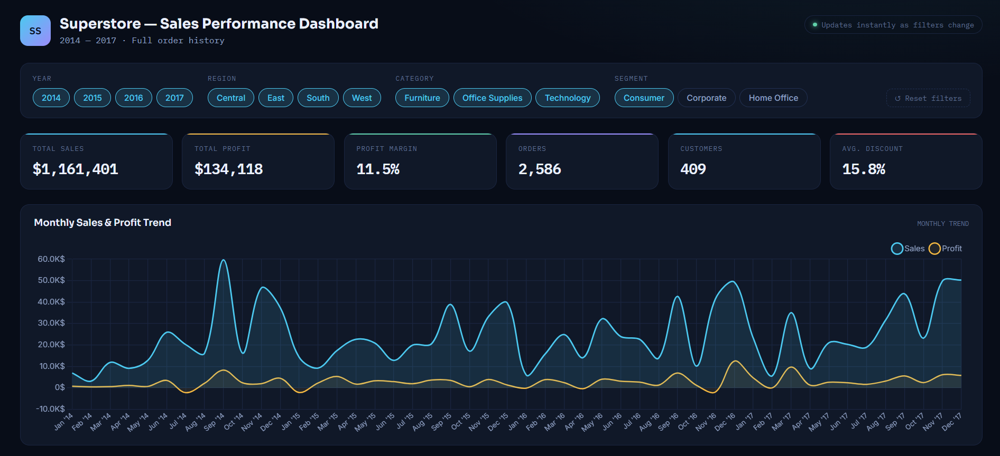

# 📊 Superstore Sales Analysis & Forecasting

An end-to-end Data Analytics project that analyzes Superstore sales data, extracts business insights, forecasts future sales using Prophet, and visualizes the results through an interactive Power BI dashboard.

---

## 🚀 Project Overview

This project aims to analyze historical retail sales data to uncover business insights, identify top-performing products and regions, evaluate the impact of discounts, and forecast future sales to support business decision-making.

---

## 🎯 Business Objectives

- Analyze overall sales performance
- Identify top-selling products
- Determine the most profitable categories and regions
- Analyze customer purchasing behavior
- Evaluate the impact of discounts on profitability
- Forecast future monthly sales using Prophet

---

## 🛠️ Tools & Technologies

- Python
- Pandas
- NumPy
- Matplotlib
- Prophet
- Power BI
  
---

## 📈 Project Workflow

- Data Cleaning
- Exploratory Data Analysis (EDA)
- Feature Engineering
- Sales Forecasting using Prophet
- Interactive Power BI Dashboard

---

## 📊 Dashboard Features

- Total Sales
- Total Profit
- Profit Margin
- Total Orders
- Total Customers
- Average Discount
- Monthly Sales Trend
- Sales by Category
- Sales by Region
- Top Products
- Top Customers
- Discount vs Profit Analysis
- Interactive Filters

---

## 💡 Key Insights

- Technology generated the highest sales.
- California was the top-performing state.
- The West region achieved the highest revenue.
- Higher discounts generally reduced profitability.
- Sales showed seasonal patterns suitable for forecasting.

---

## 📂 Project Structure

```text
Superstore-Sales-Analysis/
│
├── data/
├── notebooks/
├── dashboard/
├── images/
├── README.md
└── requirements.txt
```

## 📷 Dashboard Preview

### Dashboard Overview



### Sales Analysis


### Regional Analysis


---

## 🔮 Future Improvements

- Improve forecasting accuracy
- Deploy the dashboard as a web application
- Automate data updates
- Add customer segmentation models

---

## 👨‍💻 Author

**Youssef Hussein**

